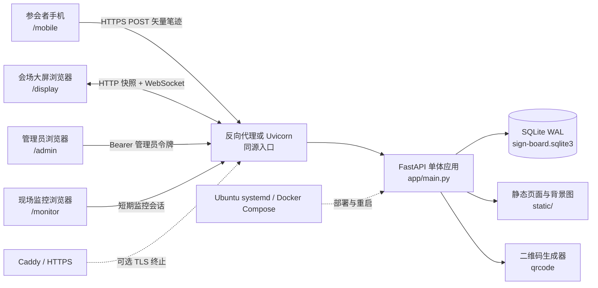
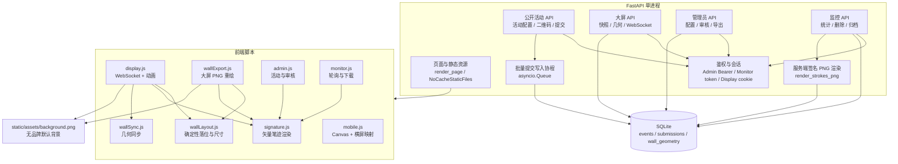
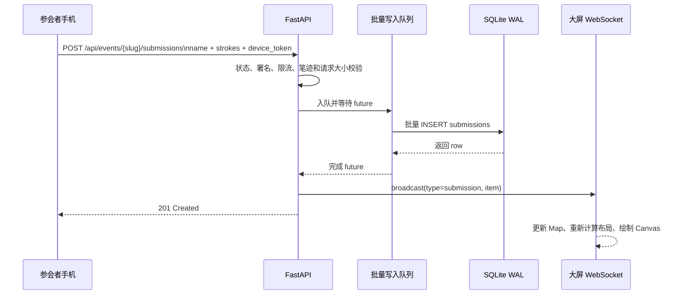
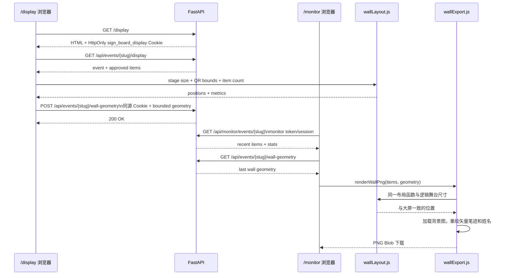
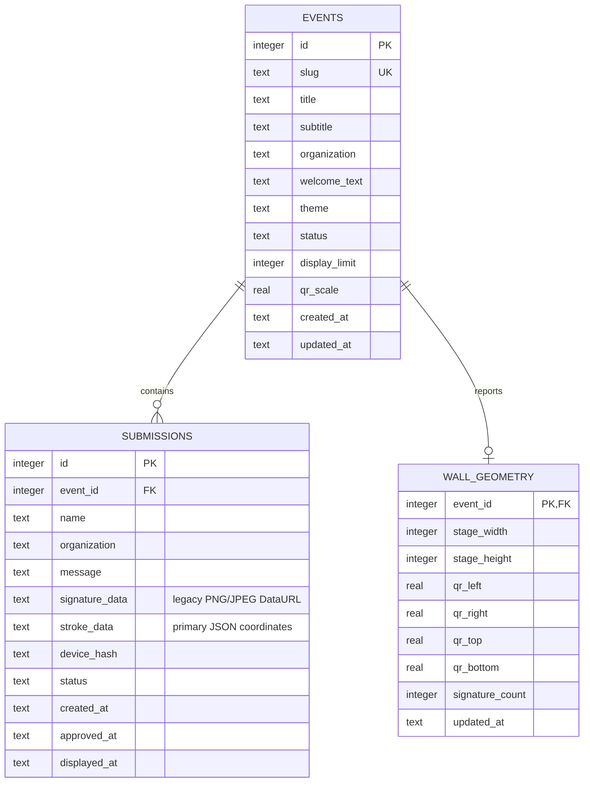
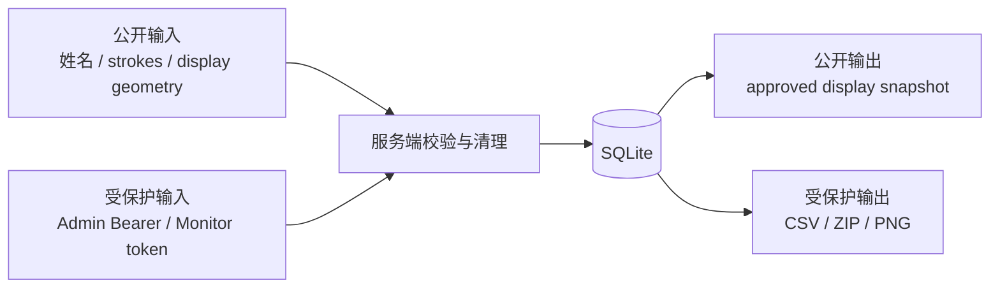

# 系统架构图

本文描述 `v1.0.0` 的运行时架构、数据流、信任边界和持久化模型。图表使用 Mermaid，可在支持 Mermaid 的 Markdown 阅读器中直接渲染。

## 1. 系统上下文

边界说明：四类浏览器都访问同一个源，服务端没有独立前端构建产物。WebSocket 只服务于大屏实时更新；监控页使用定时轮询，管理员页使用请求-响应。

## 2. 服务内部组件

## 3. 提交与实时展示时序

失败路径：写入超时返回 `503`，参与者可以重试；批次异常只影响当前批次，写入协程继续存活。活动不是 `live` 时在进入队列前返回 `409`。

## 4. 大屏布局与 PNG 导出时序

几何写入只允许近期打开过 `/display` 的同源浏览器会话。Cookie 是范围受限的显示能力，不是管理员凭据；严格的宽高、比例和像素限制是第二道防线。

## 5. 数据模型

当前数据库是单文件 SQLite，启用 WAL、外键和 busy timeout。`init_db()` 会在启动时补充历史列；这能支持当前部署升级，但还不是可审计的迁移系统。

## 6. 信任边界

- 公开提交只允许读取公开活动配置和写入自己的签名；文本长度、控制字符、笔迹点数和状态由服务端约束。
- 管理员令牌以 Bearer 形式发送，管理员配置和审核接口不会被公开页面调用。
- 监控令牌允许下载和删除，因此必须按可写凭据管理，不应公开转发。
- 大屏快照只返回 `approved` 记录；`hidden`、`rejected` 不进入展示数据。
- 导出数据包含姓名和签名，属于个人数据，应在活动结束后按保留策略处理。
